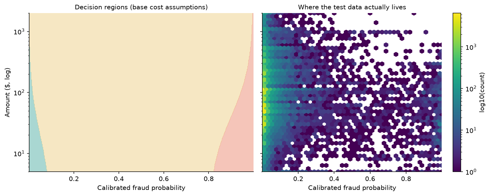
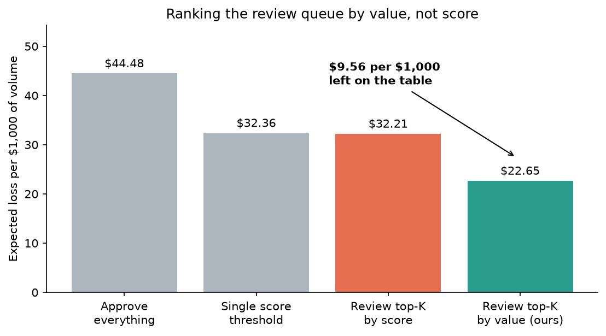
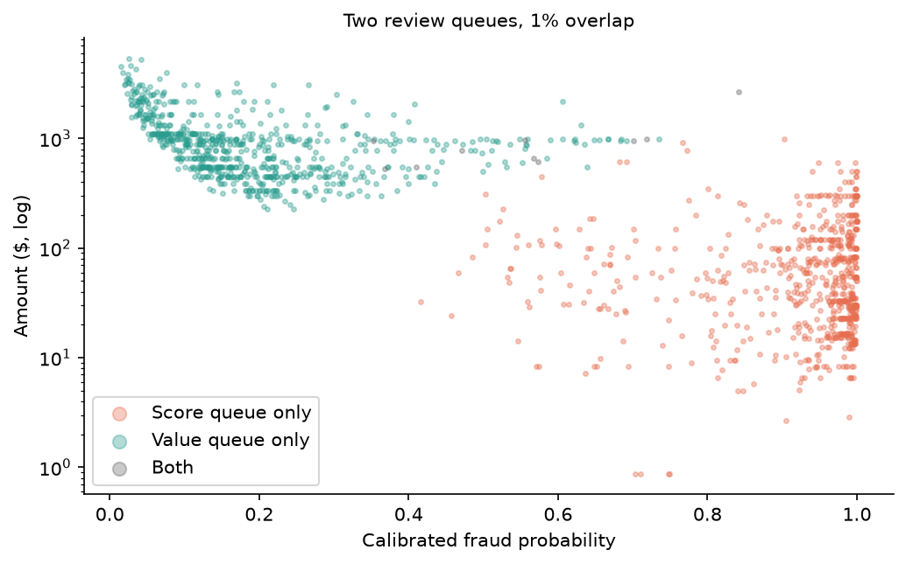
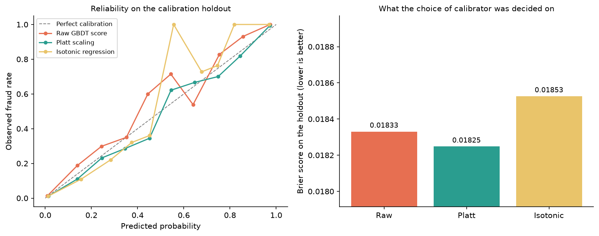
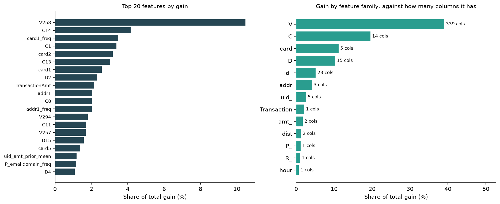
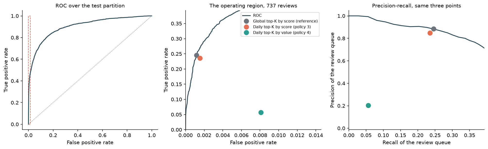
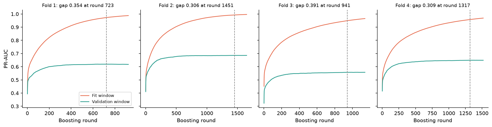
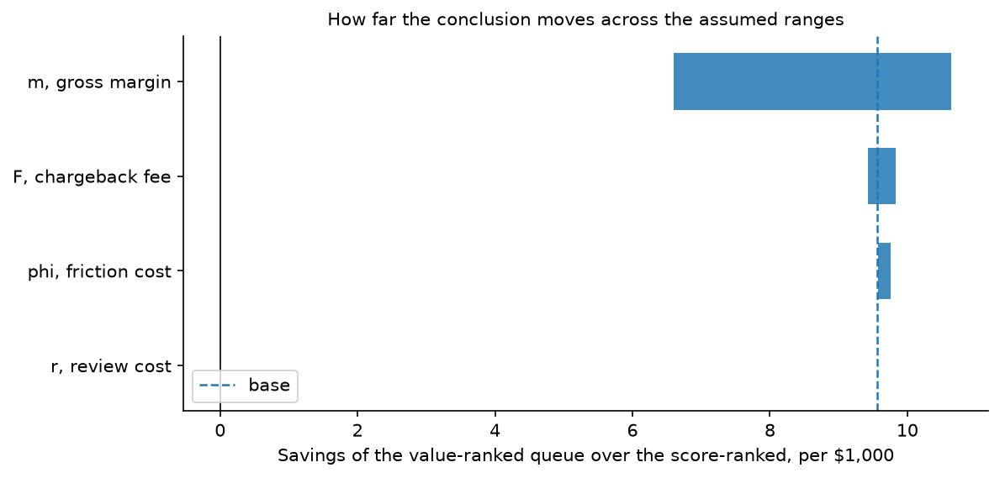
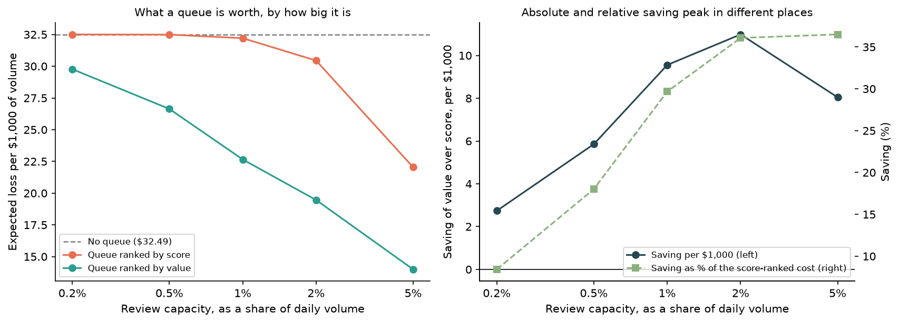
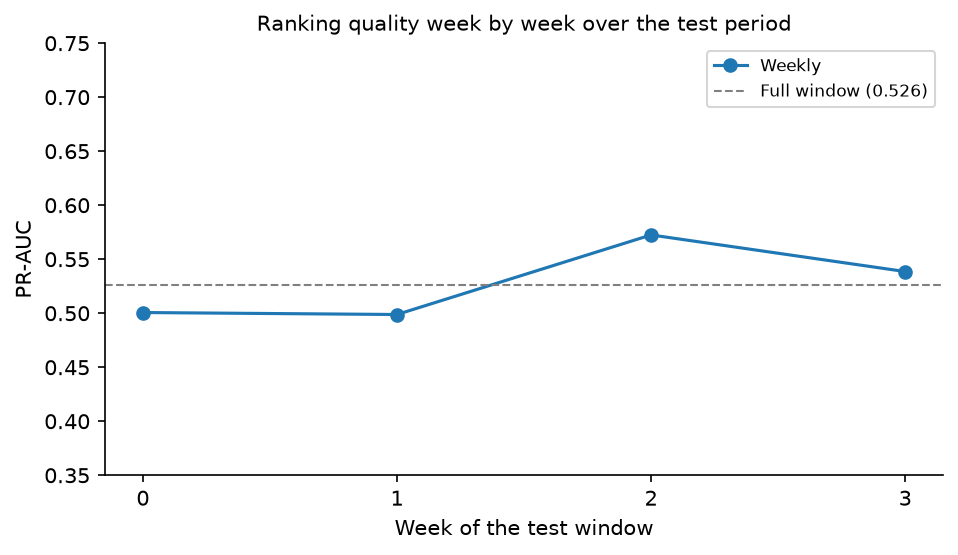

# Fraud Review Queue

**Cost-optimal allocation of a capacity-constrained fraud review queue.**

> **Status: results measured (August 2026).** The design is fixed, the pipeline
> runs end to end on the real data, the numbers below come from a single scoring
> of the held-out test partition, and the sensitivity sweep is done: the
> conclusion holds across the full assumed range of every cost parameter.
> Full spec in `docs/design.md`.

**This README is the summary. [`docs/report.md`](docs/report.md) is the full
analysis**, from the problem statement to the result, with the evidence for each
decision at the point it was made: the exploration, the entity-resolution
finding, the feature importance, the overtraining diagnostics and the drift.

---

## The problem

A payment processor cannot manually inspect every transaction, and cannot
automate every decision either. Real fraud operations run a **three-zone
policy**: block automatically above a high score, approve automatically below a
low one, and send the ambiguous middle to a **manual review queue**, one with **finite
analyst capacity**.

That makes this an **allocation problem**, not a classification problem: how do
you spend a scarce human resource under uncertainty?

Because the cost of approving fraud scales with the transaction amount, and so
does the cost of blocking a legitimate customer, **the optimal thresholds are
not constants: they depend on the amount.** A single-threshold system is
structurally the wrong policy.

And once capacity binds, the correct quantity to rank the queue by is not the
fraud score but the **value of review**:

```
V = min( p·(a + F),  (1 − p)·(m·a + φ) ) − r
```

This is the expected-cost reduction from sending a transaction to a human
rather than deciding it automatically.

`V` peaks at **moderate** probabilities and grows with the amount. Ranking by
score concentrates analysts where the system is already confident, and where a
human therefore adds little. **This project measures what that costs.**

**The argument needs one fact about the data to be worth anything, and the data
supplies it.** The fraud rate is essentially flat along the amount axis: the top
amount decile runs at 5.1 % against 5.6 % for the bottom. But the top amount
quartile holds **31.5 % of the fraudulent cases and 75.5 % of the fraudulent
money**. Probability barely moves with the amount and the loss moves by a factor
of three, so a queue sorted by probability is sorted on the axis that carries no
money. Had the fraud been concentrated in small amounts, `V` would still peak at
moderate `p` by algebra and the dollar difference would have been negligible.



The left panel is the decision boundary the cost model implies: it bends with
the amount, which is why a single threshold on the score cannot trace it. The
right panel is where the transactions actually are.

Derivations, assumptions, and project invariants: `docs/design.md`.

---

## The data

[IEEE-CIS Fraud Detection](https://www.kaggle.com/c/ieee-fraud-detection)
(Vesta Corporation). ~590k e-commerce transactions, ~3.5 % fraud rate, ~6 months,
~430 features.

**Note:** this is a competition dataset, and the public test labels do not exist.
The competition test files are ignored. All partitions here are derived from
`train_transaction` **by time**.

---

## Key decisions

**Temporal split with a label-availability embargo.**
Fraud labels arrive weeks late via chargebacks. A contiguous train/test split
implicitly assumes instantaneous label availability. A 10-day embargo between
train and calibration simulates production reality.

**No SMOTE, no class weighting.**
Resampling distorts predicted probabilities, and the entire cost layer depends
on `p` being a real probability. Class imbalance is addressed by choosing the
right *metric*, not by altering the training distribution. Reliability curves for
the uncalibrated model, Platt scaling, and isotonic regression are reported side
by side.

**The UID: entity resolution, not leakage.**
A customer identifier can be reconstructed from `card1`, `addr1` and a
normalisation of `D1`. In production, such an identifier exists, so recovering it
is legitimate. What *would* be leakage is aggregating the target over it. Every
UID aggregate here is strictly backward-looking.

**A leakage test, written before the features.**
`tests/test_no_future_leakage.py` asserts that features computed over the full
history are identical to features computed over the truncated history, for every
row inside the truncation. Honest features cannot tell the difference.

---

## Results

*Held-out test partition: days 156 to 182, 75,190 transactions, 2,655 of them
fraudulent. Scored once. Review capacity is 1 % of each day's volume, which on
this partition is 20 to 32 reviews a day and 737 across the window.*



| Policy | Expected loss / $1k volume | Fraud caught | Fraud missed | Legit blocked |
|---|---|---|---|---|
| Approve everything | $44.48 | 0 | 2,655 | 0 |
| Single score threshold | $32.36 | 1,250 | 1,405 | 1,067 |
| Review top-K by score | $32.21 | 1,271 | 1,384 | 1,012 |
| **Review top-K by value** | **$22.65** | **1,343** | **1,312** | **939** |

**Ranking the queue by value rather than by score saves $9.56 per $1,000 of
volume: a 29.7 % reduction in expected loss.** Both queue policies spend the
same 737 reviews and both run at full utilisation, so the gap is not extra
capacity. It is the same capacity aimed at different transactions. Ranking by
value also catches more fraud (1,343 against 1,271) while blocking fewer
legitimate customers (939 against 1,012), which is the part a pure
classification metric cannot see.

How different are the two queues? Measured rather than asserted: they overlap by
**0.7 %**. Almost every case a value-ranked queue sends to an analyst is one a
score-ranked queue would never have shown them.



Note that the single threshold and the score-ranked queue are nearly tied
($32.36 against $32.21). Adding a capacity-constrained queue on top of a
threshold buys almost nothing if the queue is filled by score. What pays is the
ranking quantity.

### Model

| Metric | Value |
|---|---|
| PR-AUC | 0.526 |
| ROC-AUC | 0.903 |
| Brier score (calibrated) | 0.0229 |
| ECE (calibrated) | 0.0029 |

A logistic regression on 22 declared features is the baseline the 0.526 should
be read against: it gets **PR-AUC 0.199**, so the gradient boosting model is
worth **2.6 times** it, against a base rate of 0.035.

Platt scaling won on the temporal holdout inside the calibration partition
(Brier 0.01825, against 0.01833 uncalibrated and 0.01853 isotonic). Cross
validation inside the training window gave a mean PR-AUC of 0.628 across four
expanding-window folds.



**Reported by decile, not only in aggregate**, because the average hides the
error where the money is: the ECE over the whole partition is 0.0029, but in the
top score decile the gap is **0.0256**, where the model predicts 27.2 % fraud and
observes 24.6 %. That is the decile the review queue is filled from.

Of the 412 features, 399 were split on at least once and the top 25 carry 57.3 %
of the total gain. Per column the picture is not the one the column counts
suggest: the 339 anonymised V-columns hold 39.0 % of the gain and the 14
C-columns hold 19.6 %, so a C-column is worth about twelve times a V-column.



**Where a capacity-constrained queue sits on the ROC is not where a
classification metric would put it.** At the same 737 reviews, the value-ranked
queue holds 20.4 % fraud against 84.8 % for the score-ranked one, and costs
$9.56 per $1,000 less. Queue precision measures how much fraud an analyst sees;
it does not measure whether the analyst changed the outcome, and only the second
is worth paying for. `docs/report.md` §8.5 works through it.



### Overtraining, measured where it can be measured

The split here is **temporal**, and that changes which diagnostic answers the
question. Comparing the score on train against the score on test would sum
overtraining and genuine drift without separating them. The clean measurement
records PR-AUC per boosting round on the fit window and the validation window of
the **same** cross-validation fold, which are adjacent in time, so drift is
roughly constant between them and what is left is the gap.



| | PR-AUC | What separates it from the row above |
|---|---|---|
| Fit window, at the chosen round | 0.968 | |
| Validation window, same fold | 0.628 | **Overtraining** |
| Held-out test | 0.526 | **Temporal distance**, not overtraining: both rows are out of sample |

The gap of 0.34 is not a defect: early stopping selected the round where the
validation curve peaks, so training less would leave performance on the table.
The folds are retrained by `make diagnostics`, which aborts unless they choose
the 1,129 trees the persisted booster already has.

The Kolmogorov-Smirnov comparison is reported too, and read as a distance rather
than a p-value. On fraudulent transactions train sits far from both other
partitions (`D` = 0.399 and 0.412) while the two the model never saw sit on top
of each other (`D` = 0.027): drift would have moved those apart as well, and did
not. The same table carries its own warning about sample size, since `D` = 0.023
comes with p = 1.4e-16 while a **larger** `D` = 0.027 comes with p = 0.317,
purely because there are 28 times fewer fraudulent rows. `docs/report.md` §8.3
and §8.4.

---

## Sensitivity

The four cost parameters (`F`, `m`, `φ`, `r`) are **assumptions, not
measurements**. Each is swept across its plausible range, one at a time with the
rest at base, over the scoring that was already persisted: varying a cost
parameter re-scores nothing, it moves only the decision layer above predictions
that were already made.



| Parameter | Range | Saving at low | Saving at high | Swing |
|---|---|---|---|---|
| `m`, gross margin | 0.15 to 0.40 | $6.60 | $10.64 | **$4.05** |
| `F`, chargeback fee | $10 to $40 | $9.42 | $9.83 | $0.40 |
| `φ`, friction cost | $2 to $30 | $9.58 | $9.75 | $0.18 |
| `r`, review cost | $1 to $5 | $9.56 | $9.56 | $0.00 |

**The conclusion survives the full range.** The saving is never smaller than
$6.60 per $1,000, against $9.56 at the base assumptions. Every bar of the
tornado sits to the right of zero, so ranking the queue by value wins under
every combination of assumptions considered, not only the ones chosen.

**Gross margin dominates, by an order of magnitude over the next parameter.**
That is the answer to the second question `docs/design.md` §7.2 asks of this
sweep, and it is an output of the
analysis rather than an input: if this were a real operation, the next dollar of
measurement effort belongs on the margin, not on the chargeback fee and not on
the model.

**Review cost does not move the result at all**, and the zero is exact rather
than rounded. Both queue policies spend the same 737 reviews, so `r` enters both
sides of the comparison identically and cancels. It is also a constant
subtracted from every transaction's value of review, so it cannot reorder the
queue either. Within its assumed range the only way it could matter is by
pushing cases below `V > 0`, and on this data it never binds: it takes roughly
`r = 50` before the value-ranked queue declines to spend its capacity, which is
25 times the assumed cost of an analyst touching a case.

### And how big is the queue?

Capacity is not an assumption about the business, it is a fact about an
operation, so it is swept separately.



| Capacity | Reviews | By score | By value | Saving |
|---|---|---|---|---|
| **none** | 0 | **$32.49** | **$32.49** | |
| 0.2 % | 137 | $32.51 | $29.77 | $2.74 |
| 0.5 % | 363 | $32.49 | $26.64 | $5.85 |
| 1.0 % | 737 | $32.21 | $22.65 | $9.56 |
| 2.0 % | 1,489 | $30.45 | $19.46 | $10.98 |
| 5.0 % | 3,745 | $22.04 | $14.00 | $8.04 |

**A score-ranked queue is worth less than nothing until it is fairly large.** At
0.2 % capacity it costs more than having no queue at all, and it does not pay for
itself until 1 %: its first analysts go to cases at `p > 0.9` that the automatic
rule was already blocking, so each review costs `r` and changes nothing. **The
value-ranked queue is ahead from the very first analyst.** The dollar saving
peaks at 2 % of volume, which is where a marginal analyst is worth most.

---

## Drift

PR-AUC and fraud rate across the test window, in seven-day bins. The window is
27 days, which is why they are weeks: the natural monthly binning returns a
single point, and one point drawn as a trend line invites a reading of drift
that was never measured.



| Week | Transactions | Fraud rate | PR-AUC |
|---|---|---|---|
| 0 | 19,692 | 2.84 % | 0.501 |
| 1 | 20,996 | 3.62 % | 0.499 |
| 2 | 19,782 | 3.70 % | 0.572 |
| 3 | 14,720 | 4.09 % | 0.539 |

Ranking quality oscillates around the full-window value of 0.526 and ends 7.6 %
above where it started. **There is no measurable decay here, and that is a
statement about the window rather than about the model**: 27 days is too short
to establish a retraining cadence, which is what §7.3 wants this report for. The
fraud rate does climb steadily, from 2.84 % to 4.09 %, which is the kind of
movement that would matter over a longer horizon.

---

## Limitations

- Analyst review is assumed perfect. Real analysts have a detection rate below 1.
- Cost parameters are assumed. Mitigated by the sensitivity analysis, not removed.
- No feedback loop: blocking a transaction means never learning whether it was
  fraud. A deployed system faces selective labelling; this offline evaluation
  does not model it.
- Static capacity. Real queues have shifts, backlogs, and SLA prioritisation.
- The data is from 2017-2018. Fraud patterns have moved.
- **The entity resolution over-splits.** The UID assumes `D1n = day - D1` is
  constant per card, and it is not: only 15.7 % of `(card1, addr1)` groups have a
  single `D1n`, so 58 % of UIDs end up carrying one transaction and the
  backward-looking features are sparse. The error is in the safe direction, since
  a UID that merged customers would manufacture history between strangers, but it
  costs those five features most of their potential. `docs/report.md` §5.1.
- **Feature drift is now measured, and it is not there.** PSI of the top 25
  features against train, week by week of test, peaks at **0.0746**, below even
  the 0.10 line for stability. The fraud *rate* does climb over the same window,
  from 2.84 % to 4.09 %, and PSI does not look at labels: stable inputs with a
  rising fraud rate argues for retraining on a schedule rather than on a drift
  alarm. `make diagnostics` produces it.

---

## Run it

```bash
uv sync

# The whole chain on synthetic data: no Kaggle account, no download, seconds.
# It proves the pipeline runs; it says nothing about fraud.
uv run python -m fraudq.pipeline --synthetic
```

With the real data:

```bash
# Requires a Kaggle account, and the competition rules accepted once on the web:
# https://www.kaggle.com/c/ieee-fraud-detection/rules
./scripts/download_data.sh              # -> data/raw/train_*.csv
uv run python -m fraudq.data.ingest     # -> data/processed/*.parquet

uv run python -m fraudq.pipeline        # features -> split -> train -> calibrate -> evaluate
uv run python -m fraudq.analysis        # the sensitivity sweep and the drift report
uv run streamlit run app/streamlit_app.py
```

The pipeline writes `reports/scored_calib.parquet`, `reports/scored_test.parquet`,
`reports/policy_comparison.csv` and `models/artifacts/`. Everything downstream
(the sensitivity sweep, the drift report, the API and the queue simulator) reads
those, so **the test partition is scored once and never looked at again**. The
pipeline takes about 15 minutes on four cores; the analysis on top of it takes
20 seconds, because it re-scores nothing.

The figures in this README come from `notebooks/03_results.ipynb`, which reads
the same artefacts and draws. It computes no policy of its own.

The scoring API ships as a container. Model artifacts are mounted, not baked in:
the image is the code, the model is data with its own lifecycle.

```bash
docker build -t fraud-review-queue .
docker run --rm -p 8000:8000 -v $PWD/models/artifacts:/models fraud-review-queue
```

The **queue simulator** lets you move analyst capacity and each cost assumption
and watch the expected loss, along with the gap against score-ranked triage,
move with them.

---

## Repository structure

```
src/fraudq/
├── config.py           # every cost and policy assumption, in one place
├── pipeline.py         # the driver: chains the stages below end to end
├── analysis.py         # sensitivity and drift, off the persisted scoring
├── diagnostics.py      # importance, curves, KS, PSI, learning curve
├── data/               # ingest (CSV → parquet), temporal split, synthetic data
├── features/           # UID construction, backward-looking aggregates
├── models/             # training, probability calibration, artifact persistence
├── policy/             # cost functions, value of review, capacity allocation
├── evaluate/           # metrics, policy comparison, sensitivity, drift, diagnostics
└── api/                # FastAPI scoring endpoint

tests/                  # including the temporal leakage guard
docs/report.md          # the full analysis, problem to result
docs/design.md          # cost model, derivations, project invariants
docs/RUNBOOK.md         # how to run every stage
app/                    # queue simulator
scripts/                # Kaggle download
```

---

## License

MIT
