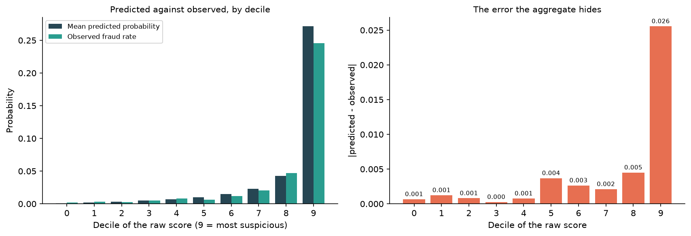
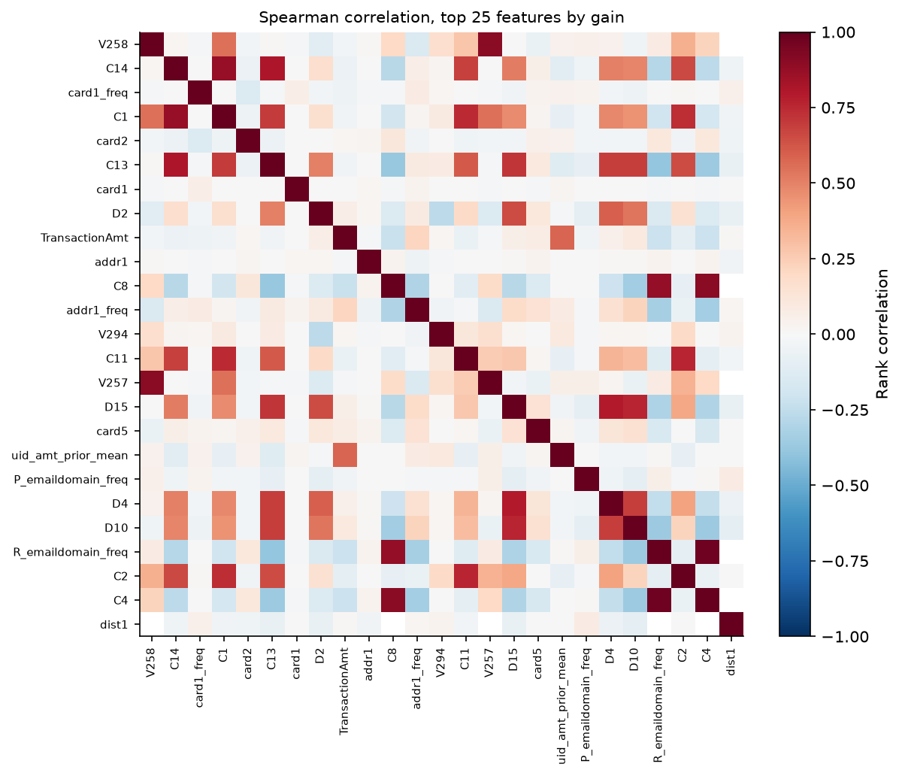
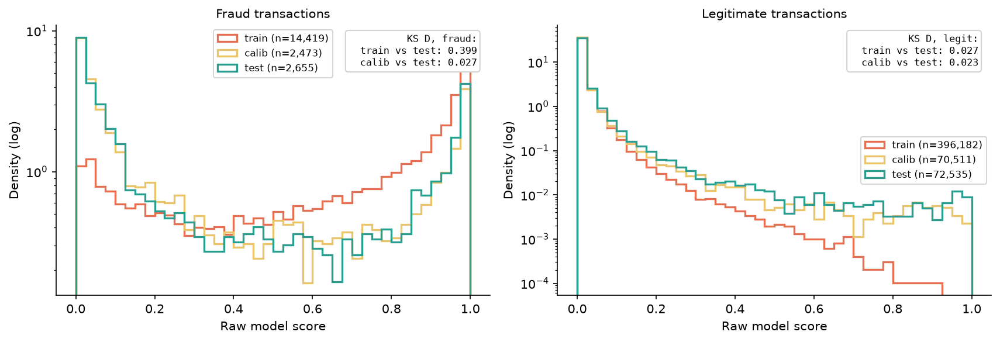
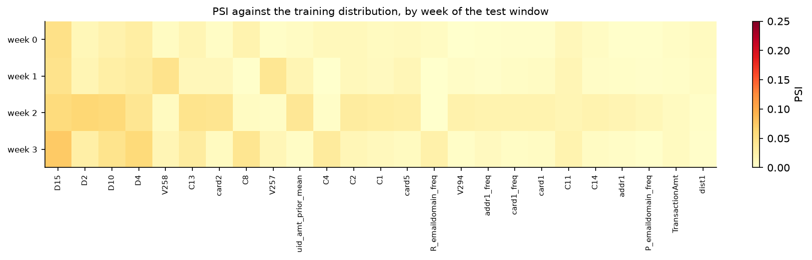

# Fraud Review Queue: analysis report

From the problem statement to the measured result, with the evidence for each
decision at the point where it was made.

This is the narrative document. Its two companions do different jobs:
[`design.md`](design.md) is the specification, written before anything was
measured, and remains the authority on **why** each rule exists; the
[README](../README.md) is the summary, and quotes the headline numbers without
the road that produced them. Everything below is reproducible with
[`RUNBOOK.md`](RUNBOOK.md).

---

## 1. Summary

A fraud team can review a small fraction of its transactions by hand. The
question this project answers is not "which transactions are fraudulent" but
**"which transactions should a human look at"**, and those are different
questions with different answers.

On a held-out month of the IEEE-CIS dataset, filling a fixed review queue by
**expected value of the review** rather than by **fraud probability** reduces
expected loss from **$32.21 to $22.65 per $1,000 of volume, a saving of $9.56
and a 29.7 % reduction.** Both queues spend the same 737 reviews at full
utilisation, so the gap is not extra capacity: it is the same capacity aimed at
different transactions.

The finding survives the full plausible range of all four cost assumptions, at
worst falling to $6.60 per $1,000. It rests on one empirical fact about the
data, established before any model was fitted: **the fraud rate is essentially
flat across the amount axis, while three quarters of the fraudulent money sits
in the top quarter of amounts.** Probability does not move with the amount and
loss does, so a queue sorted by probability is sorted on the axis that carries
no money.

---

## 2. The problem: allocation, not classification

An analyst reviewing a case resolves it correctly, at a cost `r`. The queue has
capacity for a fixed number of cases a day. Which cases?

The instinct is to send the highest-probability cases, and the instinct is
wrong. Write the expected cost of each automatic action for a transaction of
amount `a` with fraud probability `p`:

```
approve:  p * (a + F)                   lose the amount plus the chargeback fee
block:    (1 - p) * (m * a + phi)       lose the margin plus the friction cost
```

The value of sending it to a human is the cost that decision avoids:

```
V = min(approve, block) - r
```

Two consequences follow, and both are counterintuitive enough that
`design.md` §2 flags them as the decisions worth being able to defend.

**The optimal cut depends on the amount.** Setting `approve = block` and solving
gives a break-even probability that is a function of `a`, so a single global
threshold on `p` is structurally the wrong shape of answer, not merely a badly
tuned one.

**`V` is maximised at moderate `p`.** It is the minimum of a line rising in `p`
and a line falling in `p`, so it peaks where they cross, around `p = 0.2` to
`0.3`, and it grows with the amount. A case at `p = 0.95` is already decided:
the system will block it, and a human confirming that adds `r` of cost and no
information. **The queue should be ranked by `V`, not by `p`**, and the gap
between those two rankings is what this project measures.

---

## 3. The data

[IEEE-CIS Fraud Detection](https://www.kaggle.com/c/ieee-fraud-detection):
590,540 transactions over 182 days, 3.50 % fraudulent, with a companion identity
table. Time is an offset in seconds, not a calendar, so everything here is
expressed in days from the start.

The exploration was timeboxed to five questions written before the data was
opened ([`notebooks/01_eda.ipynb`](../notebooks/01_eda.ipynb)). Four of them
confirmed a design assumption. One did not, and it is the more useful of the
five.

### 3.1 Fraud is flat across the amount axis. The money is not.

| Amount decile | 1 | 2 | 3 | 4 | 5 | 6 | 7 | 8 | 9 | 10 |
|---|---|---|---|---|---|---|---|---|---|---|
| Fraud rate | 5.6 % | 3.2 % | 3.2 % | 1.9 % | 2.9 % | 3.6 % | 2.0 % | 4.3 % | 3.8 % | 5.1 % |

The top decile and the bottom decile are within 10 % of each other. The median
fraudulent transaction is $75.00 against $68.50 for a legitimate one. **Amount
barely predicts fraud.**

The dollars behave completely differently. The top amount quartile begins at
$125.00 and holds **31.5 % of the fraudulent cases but 75.5 % of the fraudulent
money**. Approving everything would lose $3,083,845 over the window.

This is the empirical precondition of the whole thesis, and it is worth being
explicit that it could have failed. Had the fraud been concentrated in small
amounts, `V` would still have peaked at moderate `p` by algebra, but the dollar
difference between the two rankings would have been negligible and the project
would have had nothing to report.

### 3.2 Identity is a left join, and the V-columns are 15 blocks

Identity covers **144,233 of 590,540 transactions, 24.4 %**. An inner join would
discard three quarters of the dataset, and the absence of identity data is
itself a signal, which LightGBM consumes natively as NaN.

The 339 anonymised V-columns fall into **15 blocks by exact null pattern** over
the full dataset, sized 46, 43, 32, 31, 23, 22, 20, 19, 18, 18, 18, 16, 11, 11
and 11. Columns within a block are null on precisely the same rows, the
signature of having been derived from one source. That structure is recovered
without looking at a single value, which is what `design.md` §5.4 asks for.

### 3.3 The categoricals that carry signal

Against a 3.50 % base rate: `ProductCD` category `C` runs at **11.7 %** against
2.0 % for `W`, which is 74 % of the volume. `card6` separates credit at **6.7 %**
from debit at 2.4 %. `card4` is essentially flat and carries little. Email
domain separates too, from `outlook.com` at 9.5 % down to `comcast.net` at 3.1 %.

Cardinalities, which decide the encoding: `card1` 13,553 distinct values,
`addr1` 332, `P_emaildomain` 59, `R_emaildomain` 60.

---

## 4. Splits: temporal, with an embargo

| Partition | Days | Rows | Fraud | Rate |
|---|---|---|---|---|
| train | 1 to 119 | 410,601 | 14,419 | 3.51 % |
| embargo | 120 to 129 | 31,765 | 1,116 | 3.51 % |
| calibration | 130 to 155 | 72,984 | 2,473 | 3.39 % |
| test | 156 to 182 | 75,190 | 2,655 | 3.53 % |

**Never a random split.** A shuffled split on this dataset validates on the past
a model trained on the future, which is not the problem anyone deploys.

**The 10-day embargo** between train and calibration exists because chargeback
labels arrive late. A model trained right up to the calibration boundary would
be assuming a label latency of zero, which no real operation has.

**The calibration partition sees only held-out data**, and carries 2,473
positives, comfortably enough to fit an isotonic step function without it
turning jagged. The fraud rate is flat across all four partitions, between
3.39 % and 3.53 %, so no partition is being asked to learn or verify a different
problem from the others.

**Test is looked at once.** Every number in section 10 comes from a single
evaluation, persisted immediately. The sensitivity sweep and the drift report
work off that persisted scoring and never look at test again.

---

## 5. Features

412 numeric features, in three groups.

**Base features**, which depend only on their own row and so cannot leak:
`log1p` of the amount, the fractional part of the amount (a program-generated or
currency-converted amount leaves a signature there that a human purchase ending
in .00 or .99 does not), and the hour of day.

**Frequency encodings** of the four high-cardinality categoricals, **fitted on
train only**. Computing them over the whole dataset would let the calibration
and test distributions shape the representation the model trains on. A category
unseen in train gets frequency 0, which is the correct answer: at training time
it did not exist.

**Backward-looking aggregates over a customer UID**, and this is the part with a
finding attached.

### 5.1 The UID over-splits, and that is the safe direction

The UID is `card1 + addr1 + D1n`, where `D1n = day - D1` approximates the card's
registration date. Every aggregate over it is strictly backward-looking,
expressed in SQL as `ROWS BETWEEN UNBOUNDED PRECEDING AND 1 PRECEDING`, which is
the anti-leakage invariant written as a window frame.
[`tests/test_no_future_leakage.py`](../tests/test_no_future_leakage.py) enforces
it: features computed over the full history must be identical to features
computed over the history truncated at any cut, for every row before the cut.

The EDA asked whether `D1n` is constant per card, and the answer is **no**. Of
the 17,177 `(card1, addr1)` groups with at least three transactions, only
**15.7 % have a single `D1n`**, covering **3.2 % of transactions**.

That is not noise in the proxy. Widening the tolerance from an exact match to a
30-day window moves the share of groups only from 15.7 % to 21.1 %, and among
the non-constant groups the **median spread of `D1n` is 208 days**, with a 90th
percentile of 615.

The finding is about the key rather than the proxy. With `card1` taking 13,553
values and `addr1` only 332, `(card1, addr1)` is closer to an issuer-and-region
bucket than to a customer, and `D1n` is what splits that bucket into something
customer-shaped. The consequence is that the UID **over-splits**: it produces
199,070 UIDs over the 523,746 transactions that have one, and **58 % of those
UIDs carry a single transaction**.

**Over-splitting is the safe direction to be wrong in**, and the asymmetry is
worth stating plainly. A UID that merged distinct customers would manufacture
history between strangers and inflate every aggregate built on it. A UID that
splits one customer into several merely withholds history from itself. The cost
is coverage, not correctness, and it is paid in feature strength: the five
`uid_` features end up carrying 2.6 % of the model's total gain.

---

## 6. The model

**LightGBM**, with a logistic regression on a small numeric feature set as an
honest baseline. No model zoo.

**No resampling, and it is enforced rather than asked for.** No SMOTE, no
undersampling, no `scale_pos_weight`, no `is_unbalance`. All of them distort
predicted probabilities: a model trained on a 50/50 resample of a 3.5 % base
rate predicts probabilities for the resampled distribution, not the real one.
The entire decision layer requires `p` to be a real probability, because if `p`
is meaningless then `V` is meaningless. `models/train.py` **raises** if a
resampling parameter appears in the configuration.

Class imbalance is not a problem in itself. What needs adjusting is the
evaluation metric, PR-AUC, not the training procedure.

**Hyperparameters are fixed in `config.py`** and the number of trees comes from
an expanding-window cross-validation inside train (days 0 to 119, four folds of
20 validation days each). Neither calibration nor test is touched by that
choice. The median best iteration across folds gives the 1,129 trees of the
final model, fitted on all of train with no early stopping, because there is no
legitimate validation set that is not from the future and settling that was
exactly the cross-validation's job.

### 6.1 The baseline, so that 0.526 means something

A PR-AUC of 0.526 is not interpretable on its own. It is interpretable next to
what a simple model gets on the same partition, so a logistic regression is
fitted on train and evaluated on test under exactly the same rules: median
imputation, standardisation, `class_weight=None`, and one look.

**Its 22 features are declared, not derived from the trained model.** They are
the §5.1 base features, the four frequency encodings and the C family, chosen
out of the design document. Building the baseline from the top of the gain
ranking would have been a different and much less interesting experiment: it
would measure how much of the LightGBM model a linear form can recover, not what
an honest simple model achieves by itself.

| Model | Features | PR-AUC | Against chance | ROC-AUC |
|---|---|---|---|---|
| Chance (the base rate) | | 0.035 | 1.0x | 0.500 |
| Logistic regression | 22 | 0.199 | 5.6x | 0.775 |
| **LightGBM** | 412 | **0.526** | **14.9x** | **0.903** |

The gradient boosting model is worth **2.6 times the logistic baseline** on the
metric that leads. That is the number that makes the modelling effort defensible,
and it is worth noting that the baseline is itself far from useless: most of the
distance from chance to the final model is covered by 22 features and a linear
form, which is the usual and frequently unreported shape of this comparison.

---

## 7. Calibration

Fitted **only** on the calibration partition, which the model never trained on.
The choice between the two methods uses a temporal holdout inside calibration:
comparing on the data used to fit would always favour isotonic, which is the
more flexible of the two.


| Calibrator | Brier | ECE |
|---|---|---|
| Raw score | 0.01833 | 0.00597 |
| **Platt scaling** | **0.01825** | **0.00417** |
| Isotonic regression | 0.01853 | 0.00490 |

**Platt won, by thousandths.** The honest reading of a margin that small is that
the raw LightGBM score was already close to calibrated; Platt improves it
slightly, and isotonic, being the more flexible, overfits the holdout and comes
last. On test the calibrated probabilities reach **Brier 0.0229 and ECE 0.0029**.

### 7.1 The aggregate hides the error where it matters

`design.md` §6.3 makes a specific claim: a model can be well calibrated on
average and badly calibrated at the top of the score, which is exactly where the
expensive decisions are made. The claim turns out to be right about this model.



| Decile of raw score | 0 | 3 | 6 | 8 | **9** |
|---|---|---|---|---|---|
| Mean predicted | 0.0011 | 0.0050 | 0.0147 | 0.0427 | **0.2715** |
| Observed rate | 0.0017 | 0.0048 | 0.0121 | 0.0472 | **0.2459** |
| Gap | 0.0007 | 0.0003 | 0.0026 | 0.0045 | **0.0256** |

**The gap in the top decile is 0.0256, roughly nine times the aggregate ECE of
0.0029**, and it points the same way throughout: in the 10 % of transactions the
model finds most suspicious it predicts 27.2 % fraud and observes 24.6 %, so it
is **overconfident by 2.6 percentage points precisely where the review queue
lives**.

That is not a large error and it does not undermine the results, but it is the
number the cost layer actually depends on, since `V` is computed from `p` and the
queue is filled from the top. An aggregate ECE would have reported 0.0029 and
said nothing about it.

---

## 8. Model diagnostics

Everything above says how the model was built. This section asks what it is made
of and whether the number in section 10 can be believed. All of it is produced
by `python -m fraudq.diagnostics --learning-curve`, which loads the persisted
booster and never fits one.

### 8.1 What the score is made of


**399 of the 412 features were split on at least once; 13 were never used.** The
top 25 carry 57.3 % of the total gain. The single largest is `V258` at 10.47 %,
followed by `C14` at 4.16 % and `card1_freq` at 3.46 %.

The per-family view is the more informative one, because gain has a known bias
towards high-cardinality and continuous features, which simply have more places
to cut:

| Family | Columns | Share of gain | Gain per column |
|---|---|---|---|
| V | 339 | 39.0 % | 0.115 % |
| C | 14 | 19.6 % | 1.399 % |
| card | 5 | 11.2 % | 2.234 % |
| D | 15 | 10.3 % | 0.685 % |
| id_ | 23 | 5.2 % | 0.224 % |
| addr | 3 | 4.2 % | 1.393 % |
| uid_ | 5 | 2.6 % | 0.524 % |

**Per column, a C-column is worth roughly twelve times a V-column.** That
retrospectively justifies the timebox rule in `design.md` §5.4: the 339
anonymised columns were handed to LightGBM whole rather than studied one by one,
and had the exploration been spent on them it would have been spent on the least
informative columns in the dataset. The frequency encodings earned their place
too: `card1_freq` ranks third and `addr1_freq` twelfth, both above their raw
counterparts.

### 8.2 How much of that is redundant



Spearman and not Pearson: the C-columns, the D-columns and the amount have long
tails, and Pearson on those measures the outliers rather than the relationship.
Rank correlation is also the only structure a tree ensemble can exploit.

Of the 300 pairs among the top 25 features, **only three exceed 0.9 in absolute
value**: `R_emaildomain_freq` with `C4` at 0.973, `V258` with `V257` at 0.906,
and `C8` with `C4` at 0.900. The top of the ranking is therefore not a set of
near-duplicates, which is the failure mode this check exists to rule out. That
`V258` and `V257` are the pair is unsurprising: they sit in the same Vesta block,
and they rank first and fifteenth by gain.

A note on two numbers that look inconsistent and are not. The block count here is
**14, computed on the training partition**, against the **15** reported in
section 3.2 over the full dataset. Two blocks differ only on rows outside train
and therefore merge within it. The diagnostics use train because train is the
reference distribution everything else is compared against.

### 8.3 Overtraining, measured where it can be measured


**This is the only clean overtraining measurement in the project**, and the
reason is the split. A comparison between train and test would sum overtraining
and genuine drift without separating them, because those partitions are
separated in time. Here both series come from the same expanding-window fold, so
the validation window sits immediately after the fit window and drift is close
to constant between them. What is left is the gap.

| Fold | Best iteration | Rounds run | PR-AUC, fit | PR-AUC, validation | Gap |
|---|---|---|---|---|---|
| 1 | 723 | 923 | 0.9731 | 0.6194 | 0.3537 |
| 2 | 1,451 | 1,651 | 0.9925 | 0.6860 | 0.3065 |
| 3 | 941 | 1,141 | 0.9492 | 0.5579 | 0.3913 |
| 4 | 1,317 | 1,517 | 0.9579 | 0.6493 | 0.3086 |
| **Mean** | | | **0.9682** | **0.6282** | **0.3400** |

**The folds are retrained for this figure, and the retraining is checked against
the published model rather than trusted.** The median best iteration across the
four folds is **1,129, which is exactly the number of trees the persisted booster
carries**, and the run aborts if it is not. The mean validation PR-AUC of 0.6282
likewise reproduces the 0.628 the pipeline reported. This curve therefore
describes the model in `models/artifacts/`, not a lookalike trained alongside it.

**The gap is 0.34 and that is not a defect.** It is worth being explicit, because
a fit PR-AUC of 0.968 against a validation PR-AUC of 0.628 looks alarming out of
context. Early stopping selected the round where the validation curve is at its
maximum; training fewer rounds would leave validation performance on the table,
and training more would start to lose it. A gradient boosting model with 1,129
trees will fit its own training rows nearly perfectly whatever else is true, and
the question the curve answers is not "is there a gap" (there always is) but
"was the stopping point chosen honestly", and it was: on a window the model was
not fitted on, four times, without calibration or test being consulted.

The three rungs of the ladder are the useful summary, and each drop has a
different cause:

| | PR-AUC | What separates it from the rung above |
|---|---|---|
| Fit window, at the chosen round | 0.968 | |
| Validation window, same fold | 0.628 | **Overtraining.** Adjacent in time, so drift is held roughly constant. |
| Held-out test, days 156 to 182 | 0.526 | **Temporal distance**, not overtraining: both rungs are out of sample. Test sits 36 to 63 days further on, past the embargo and the whole calibration partition. |

That reading of the second drop is not an assumption. Section 8.4 measures the
same thing from the other side: the score distributions of the two partitions
the model never saw are nearly identical, which is what a small drift leg looks
like.

### 8.4 The score distributions, and what KS can and cannot say



| Comparison | Subset | `D` | p-value | n |
|---|---|---|---|---|
| calib vs test | all | 0.0229 | 2.5e-17 | 72,984 / 75,190 |
| calib vs test | **fraud** | **0.0266** | **0.317** | 2,473 / 2,655 |
| calib vs test | legitimate | 0.0228 | 1.4e-16 | 70,511 / 72,535 |
| train vs test | all | 0.0216 | 3.1e-26 | 410,601 / 75,190 |
| train vs test | **fraud** | **0.3992** | 0.0 | 14,419 / 2,655 |
| train vs test | legitimate | 0.0275 | 1.2e-40 | 396,182 / 72,535 |
| train vs calib | fraud | 0.4122 | 0.0 | 410,601 / 72,984 |

**Read `D` and not the p-value.** `D` is a distance between two empirical
distribution functions and does not grow with the sample; the p-value is a
statement about the sample size. The table contains its own demonstration of
that: `D = 0.0228` between calibration and test on legitimate transactions comes
with p = 1.4e-16, while a **larger** distance of 0.0266 on fraud comes with
p = 0.317, purely because there are 28 times fewer fraudulent rows. At these
sample sizes the test is asking whether two distributions are literally
identical, which they need not be to be operationally the same.

With that caveat in place, the table says something clean. **On fraudulent
transactions, train sits far from both of the other partitions (`D` = 0.399 and
0.412), while the two partitions the model never saw sit on top of each other
(`D` = 0.027).** Drift would have moved calibration and test apart as well, and
progressively, since they are consecutive in time. It did not. What separates
train from both is that the model was fitted on it.

That is a signature consistent with overtraining, and it is deliberately not
called a measurement of it: under a temporal split this comparison sums
overtraining and drift, and the reason it can be read at all here is that the
drift leg is independently visible as near-zero. The measurement proper is
section 8.3, where both series come from the same fold.

### 8.5 Where a queue sits on the ROC


ROC-AUC on test is 0.903, and that number averages over operating points no
review queue will ever occupy. A capacity of 1 % of volume puts the queue in the
far left of the curve, so that is where the figure zooms.

| Queue | Reviews | Fraud in queue | TPR | FPR | Queue precision |
|---|---|---|---|---|---|
| Global top-K by score (reference) | 737 | 652 | 0.2456 | 0.0012 | 88.5 % |
| Daily top-K by score (policy 3) | 737 | 625 | 0.2354 | 0.0015 | 84.8 % |
| Daily top-K by value (policy 4) | 737 | 150 | 0.0565 | 0.0081 | **20.4 %** |

**Three markers rather than two, because there are two separate effects.** A ROC
curve is an object about global thresholds. A review queue is not one: capacity
renews every day, so the same total spend is forced to take the best cases of
each day rather than the best cases of the window. That constraint alone moves a
score-ranked queue off the curve, before any question of how the queue is
ranked. The remaining distance to the third marker is the part that is about
ranking.

**The last row is the whole project stated in the language it is usually
argued against.** By every classification metric on that table, the value-ranked
queue is far worse: it finds a quarter as much fraud and its precision is 20.4 %
against 84.8 %. It is also the row that costs $9.56 per $1,000 less.

There is no contradiction, and the resolution is the point. A queue ranked by
score fills itself with cases at `p > 0.9`, which the automatic rule would have
blocked anyway: the review confirms a decision already taken, costs `r`, and
changes nothing. A queue ranked by `V` spends its capacity where the decision is
genuinely in doubt and the amount is large enough for being wrong to matter.
**Queue precision measures how much fraud an analyst sees. It does not measure
whether the analyst changed the outcome**, and only the second of those is worth
paying for.

---

## 9. The decision layer

Four policies are compared on test, and the comparison is built to be
conservative.

| # | Policy | What it stands for |
|---|---|---|
| 1 | Approve everything | The baseline loss |
| 2 | Single score threshold | The naive system |
| 3 | Review top-K by score | What most implementations do |
| 4 | Review top-K by value | This project |

**Policies 3 and 4 share the same automatic rule** for everything not reviewed:
the action of lower expected cost. Only the ranking of the queue differs. Had
policy 3 also been handed a worse automatic rule, the gap would mix two effects
and the headline number would be inflated. Policy 2's threshold is fitted on
calibration, never on test.

Policy 4 additionally refuses to review any case with `V <= 0`, leaving capacity
unspent rather than paying `r` for a review that buys nothing. On this data that
constraint never binds: both queues spend all 737 reviews.


---

## 10. Results

*Held-out test partition, days 156 to 182: 75,190 transactions, 2,655 of them
fraudulent. Scored once. Capacity is 1 % of each day's volume, which here is 20
to 32 reviews a day and 737 across the window.*


| Policy | Expected loss / $1k | Fraud caught | Fraud missed | Legit blocked |
|---|---|---|---|---|
| Approve everything | $44.48 | 0 | 2,655 | 0 |
| Single score threshold | $32.36 | 1,250 | 1,405 | 1,067 |
| Review top-K by score | $32.21 | 1,271 | 1,384 | 1,012 |
| **Review top-K by value** | **$22.65** | **1,343** | **1,312** | **939** |

**Ranking the queue by value rather than by score saves $9.56 per $1,000 of
volume, a 29.7 % reduction in expected loss.** Both queue policies spend the same
737 reviews at full utilisation. Ranking by value also catches more fraud overall
(1,343 against 1,271) while blocking fewer legitimate customers (939 against
1,012), which is the part a pure classification metric cannot see, and which
section 8.5 shows coexisting with a far *lower* queue precision.

Note that the single threshold and the score-ranked queue are nearly tied,
$32.36 against $32.21. **Adding a capacity-constrained queue on top of a
threshold buys almost nothing if the queue is filled by score.** What pays is the
ranking quantity.


The two queues overlap by **0.7 %**. Almost every case the value-ranked queue
sends to an analyst is one the score-ranked queue would never have shown them.

---

## 11. Sensitivity

The four cost parameters are assumptions, not measurements, and a dollar figure
without an error bar is not a result. Each is swept across its plausible range,
one at a time, over the scoring that was already persisted: varying a cost
parameter re-scores nothing, it moves only the decision layer above predictions
already made.


| Parameter | Range | Saving at low | Saving at high | Swing |
|---|---|---|---|---|
| `m`, gross margin | 0.15 to 0.40 | $6.60 | $10.64 | **$4.05** |
| `F`, chargeback fee | $10 to $40 | $9.42 | $9.83 | $0.40 |
| `phi`, friction cost | $2 to $30 | $9.58 | $9.75 | $0.18 |
| `r`, review cost | $1 to $5 | $9.56 | $9.56 | $0.00 |

**The conclusion survives the full range.** The saving never falls below $6.60
per $1,000, against $9.56 at base. Every bar sits to the right of zero.

**Gross margin dominates by an order of magnitude**, which answers the second
question a sensitivity analysis is for: if this were a real operation, the next
dollar of measurement effort belongs on the margin, not on the chargeback fee
and not on the model.

**Review cost moves the result by exactly zero**, and the zero is exact rather
than rounded. Both queue policies spend the same 737 reviews, so `r` enters both
sides identically and cancels; it is also a constant subtracted from every `V`,
so it cannot reorder the queue either. It takes roughly `r = 50` before the
value-ranked queue declines to spend its capacity, which is 25 times the assumed
cost of an analyst touching a case.

### 11.1 The other sensitivity: how big is the queue?

The tornado sweeps assumptions about the business. Capacity is not an
assumption, it is a fact about an operation, and a reader will want to substitute
their own. A result measured at one queue size says nothing about five times
that, so the five sizes of `PolicyConfig.capacity_sweep` are evaluated, fixed in
config before any result was seen.


| Capacity | Reviews | Cost, by score | Cost, by value | Saving | Saving % |
|---|---|---|---|---|---|
| **none (reference)** | 0 | **$32.49** | **$32.49** | | |
| 0.2 % | 137 | $32.51 | $29.77 | $2.74 | 8.4 % |
| 0.5 % | 363 | $32.49 | $26.64 | $5.85 | 18.0 % |
| 1.0 % | 737 | $32.21 | $22.65 | $9.56 | 29.7 % |
| 2.0 % | 1,489 | $30.45 | $19.46 | $10.98 | 36.1 % |
| 5.0 % | 3,745 | $22.04 | $14.00 | $8.04 | 36.5 % |

The first row is a reference rather than a swept point: with no queue both
policies collapse to the same automatic rule, and that is the number a queue has
to beat. Three things come out of the table, and the first is the sharpest
statement of the thesis anywhere in this report.

**A score-ranked queue is worth less than nothing until it is fairly large.** At
0.2 % capacity it costs $32.51 against $32.49 for having no queue at all, and at
0.5 % it is still marginally behind. It does not pay for itself until 1 %. The
mechanism is exactly the one §2 predicts: a queue filled by score spends its
first analysts on cases at `p > 0.9`, which the automatic rule was already
blocking correctly, so each review costs `r` and changes nothing. **A
value-ranked queue is ahead from the very first analyst**, saving $2.74 per
$1,000 at a capacity of 137 reviews across the whole window.

**The absolute and the relative saving peak in different places, and reporting
only one would mislead.** The dollar saving is largest at 2 % capacity ($10.98)
and falls at 5 % ($8.04), because by then the automatic rule has less left to get
wrong and both policies are converging on the same good decisions. The relative
saving keeps climbing and flattens around 36 %. If this operation were choosing a
headcount, 2 % of volume is where the marginal analyst is worth most.

**The `V > 0` filter never binds.** Utilisation is 1.00 at every capacity swept,
including 5 %, so the value-ranked queue always finds 3,745 cases worth reviewing
and never declines capacity it has been given. That was not guaranteed, and it
means the sweep is measuring the ranking rather than the filter.

---

## 12. Drift

Two questions, and they have different answers.

**Did the inputs move?** No, measurably.



PSI of each of the top 25 features, week by week of test, against the whole of
train as reference. **The largest value anywhere in the grid is 0.0746**, below
even the 0.10 line the industry rule of thumb calls stable, and no feature comes
close to the 0.25 line for serious drift. The input distributions the model was
trained on are still the input distributions it is being asked about.

This closes the one limitation the README previously declared and could not
measure: the persisted scoring carries only identifiers, amount, label and
probability, so PSI required rebuilding all 412 features, which is what
`fraudq.diagnostics` does.

**Did the performance move?** Not measurably either, over a window too short to
say much.


| Week | Transactions | Fraud rate | PR-AUC |
|---|---|---|---|
| 0 | 19,692 | 2.84 % | 0.501 |
| 1 | 20,996 | 3.62 % | 0.499 |
| 2 | 19,782 | 3.70 % | 0.572 |
| 3 | 14,720 | 4.09 % | 0.539 |

Ranking quality oscillates around the full-window value of 0.526 and ends 7.6 %
above where it started. **There is no measurable decay, and that is a statement
about the window rather than about the model**: 27 days is too short to
establish a retraining cadence, which is what this report is wanted for.

The fraud **rate** does climb steadily, from 2.84 % to 4.09 %, and it is worth
noting that PSI would not have seen that: PSI compares feature distributions and
does not look at labels. Stable inputs and a rising fraud rate is precisely the
combination that argues for retraining on a schedule rather than on a drift
alarm.

---

## 13. Limitations

- **Analyst review is assumed perfect.** Real analysts have a detection rate
  below 1 and take variable time. The most natural extension of this work is to
  put a detection rate into `V` and see how far the conclusion travels.
- **Cost parameters are assumed, not measured.** Mitigated by section 11, not
  removed.
- **No feedback loop.** Blocking a transaction means never observing whether it
  would have been fraud. A deployed system faces selective labelling; this
  offline evaluation does not model it.
- **Static capacity.** Real queues have shift patterns, backlogs and SLA
  prioritisation.
- **The entity resolution over-splits.** Section 5.1: 58 % of UIDs carry a single
  transaction, so the backward-looking features are sparse. The error is in the
  safe direction, but a better UID would very likely make those features worth
  more than the 2.6 % of gain they currently carry.
- **One dataset, one window.** The result is a measurement on 27 held-out days of
  one 2017-2018 dataset, not a law. Fraud patterns have moved since.

---

## 14. Reproducing this

Full instructions in [`RUNBOOK.md`](RUNBOOK.md). In short:

```bash
uv sync
./scripts/download_data.sh && python -m fraudq.data.ingest
make pipeline       # ~15 min: features, CV, training, calibration, the single look
make analysis       # sensitivity and drift, off the persisted scoring
make diagnostics    # importance, curves, KS, PSI, learning curve
```

The figures are drawn from those outputs by
[`notebooks/03_results.ipynb`](../notebooks/03_results.ipynb), which reads CSVs
and computes nothing.

To check the chain without a Kaggle account:

```bash
python -m fraudq.pipeline --synthetic --reports-dir /tmp/r --models-dir /tmp/m
```

That proves the pipeline runs. It says nothing about fraud, and the redirection
is not optional: without it, synthetic numbers overwrite the real ones.
